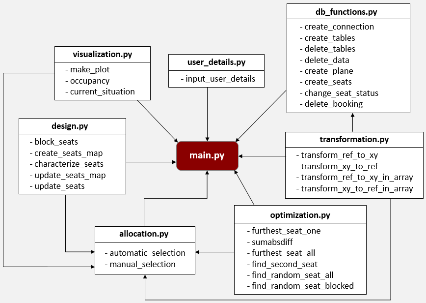
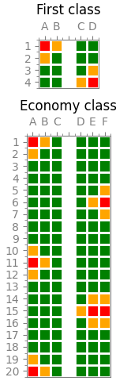

<h1 align="center"><b>Seats selection algorithm to ensure safety measures</b></h1>

 
  

<!-- CONTENTS -->
<h2 id = "contents">Contents</h2>

  
Contents

  <ol>
    <li><a href = "#introduction">Introduction</a></li>
    <li><a href = "#structure">Structure</a></li>
    <li><a href = "#database">Database</a></li>
    <li><a href = "#workflow">Workflow</a></li>
    <li><a href = "#authors">Authors</a></li>
  </ol>

<!-- ABOUT THE PROJECT -->
<h2 id = "introduction">1. Introduction</h2>

Due to the current COVID-19 pandemic, we have been forced to secure a distance between the passengers in different means of transport in order to avoid the transmission of the disease. Currently, companies have been reducing the capacity without optimizing the space and have been placing passengers unnecessarily close to each other. Considering this problem, our project aims to propose an optimal automatic seats selection during the booking process that guarantees social distancing measures by:

* Providing an efficient solution to allocate seats considering safety measures.
* Creating an algorithm that is able to automatically select the furthest seat / seats from all occupied seats.
* Suggesting and trying to keep, while possible, one empty seat in two directions.

<!-- STRUCTURE -->
<h2 id = "structure">2. Structure</h2>

 
  

Figure 1. Code structure

<!-- DATABASE -->
<h2 id = "database">3. Database</h2>

The data of the passengers and their seat preferences are going to be input through the Python code and then stored in a table within a SQL database. In this first table, we will find information about the passengers, such as their full name, ID and booking reference.

All passengers will choose their selection preference, which can be manual or automatic. The passengers who want to manually select the seats will be able to choose those that are available, at at least one seat away from others vertical and horizontally. On the other hand, the passengers that do not select their seats will have them assigned automatically at the furthest distance possible from the occupied ones.

Table 1. Passenger details.

| Passenger              | ID            | Booking reference | Selection preference | Seat |
| :---------------------:|:-------------:| :----------------:|:--------------------:|:----:|
| Matheus Nascimento     | g20200024     | 000001            | Manual               | A1   |
| Alba Vilanova Cortezon | m20201124     | 000002            | Manual               | E10  |
| Fábio Silva            | r2016669      | 000003            | Automatic            | NaN  |
| ...                    | ...           | ...               | ...                  | ...  |

In the same database, we will also create another table that defines the plane design and its seat map, which will be expressed as a matrix, where X corresponds to the column letters (from A to F) and Y to the row numbers. 

The letters "CO" for the attribute "Column" correspond to the corridor and therefore the seat organization is similar to the one that is found in the planes used for domestic flights, which have 6 seats per row and 1 corridor in the middle. The attribute "Seat" is a primary key of this table and a foreign key of the previous one. The attribute "Occupied" indicates if the seats are available or not. Initially, all seats are not booked (Occupied == False).

Table 2. Seats details.

| X    | Y    | Column | Row  | Seat  | Occupied  |
| :---:| :---:| :-----:| :---:| :----:| :--------:|
| 1    | 1    | A      | 1    | A1    | False     |
| 2    | 1    | B      | 1    | B1    | False     |
| 3    | 1    | C      | 1    | C1    | False     |
| 4    | 1    | CO     | 1    | CO1   | False     |
| 5    | 1    | D      | 1    | D1    | False     |
| 6    | 1    | E      | 1    | E1    | False     |
| 7    | 1    | F      | 1    | F1    | False     |
| ...  | ...  | ...    | ...  | ...   | ...       |

There are four conditions that have to be met:

* Passengers can only have one seat assigned to them.
* A seat can be occupied by one passenger or not occupied at all.
* A seat corresponds to one and only one plane.
* A plane must have at least one seat.

<!-- WORKFLOW -->
<h2 id = "workflow">4. Workflow</h2>

The following constraints and rules were implemented:

1. Until the capacity does not reach the limit (50%), every seat must be allocated at at least one seat away from each other. As noticed in an article in the magazine Time (2020), American airlines was leaving 50% of middle seats in economy unassigned until May 31, 2020, but said that it would use those seats if necessary.

2. If passengers make a booking for multiple people, the first constraint will not be applied and they will be able to sit together.

3. The corridor can be used as a separator for two seats, fulfilling the first constraint. The positions corresponding to the corridor in the matrix cannot be selected and only exist for the previous reason and a better visualization.

All the details about the workflow can be found in <a href = "report\Presentation.pptx">this presentation</a>. As an example, Figure 2 shows how the plane (Airbus A320 - 214 (4R-ABM/N/O)) would look like while being filled with passengers.

 
  

Figure 2. Resulting visualization.

<!-- AUTHORS -->
<h2 id = "authors">5. Authors</h2>

<b>Matheus Nascimento</b> 
Bachelor's degree in Geology at <a href ="https://ufrj.br/es/" target = "_blank">Federal University of Rio de Janeiro</a> 
Master's degree in Geospatial Technologies at <a href ="https://www.novaims.unl.pt/" target = "_blank">NOVA University of Lisbon</a>, <a href ="https://www.uni-muenster.de/en/" target = "_blank">WWU Münster</a> and <a href ="https://www.uji.es/" target = "_blank">UJI</a> 

<b>Fábio Silva</b> 
Bachelor's degree in Information Systems at <a href ="https://www.novaims.unl.pt/" target = "_blank">NOVA University of Lisbon</a> 
Master's degree in Geospatial Technologies at <a href ="https://www.novaims.unl.pt/" target = "_blank">NOVA University of Lisbon</a>, <a href ="https://www.uni-muenster.de/en/" target = "_blank">WWU Münster</a> and <a href ="https://www.uji.es/" target = "_blank">UJI</a> 

<b>Alba Vilanova Cortezón</b> 
Bachelor's degree in Mechanical Engineering at <a href ="https://www.udl.cat/ca/en/" target = "_blank">University of Lleida</a> and <a href ="http://eng.inha.ac.kr/" target = "_blank">Inha University</a> 
Master's degree in Geospatial Technologies at <a href ="https://www.novaims.unl.pt/" target = "_blank">NOVA University of Lisbon</a>, <a href ="https://www.uni-muenster.de/en/" target = "_blank">WWU Münster</a> and <a href ="https://www.uji.es/" target = "_blank">UJI</a> 

